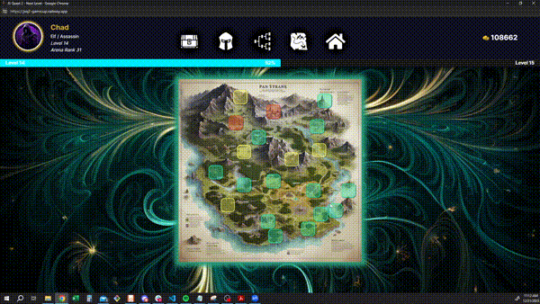

<a id='readme-top'> </a>

<br />
<div align="center">
  <a href="https://github.com/LukeLarson2/jsq2-game-frontend">
    <!--  -->
  </a>
  <h3 align="center">
    Pixel Pouch
  </h3>
  <p align="center">
    <br />
    <a href="https://github.com/LukeLarson2/jsq2-game-frontend"><strong>Explore the docs »</strong></a>
    <br />
  </p>
</div>

<details>
  <summary>Table of Contents</summary>
  <ol>
    <li>
      <a href="#about">About</a>
      <ul>
        <li>
          <a href="#built-with">Built With</a>
        </li>
      </ul>
    </li>
    <li>
      <a href="#getting-started">Getting Started</a>
      <ul>
        <li>
          <a href="#prerequisites">Prerequisites</a>
        </li>
        <li>
          <a href="#installation">Installation</a>
        </li>
      </ul>
    </li>
    <li>
      <a href="#usage">Usage</a>
    </li>
    <li>
      <a href="#roadmap">Roadmap</a>
    </li>
    <li>
      <a href="#optimizations">Optimizations</a>
    </li>
    <li>
      <a href="#contributing">Contributing</a>
    </li>
    <li>
      <a href="#contact">Contact</a>
    </li>
  </ol>
</details>

## About

<div align="center">
  <h3>Web Site/Stripe</h3>
  
<br />
    <h3>Entering Game</h3>
  
<br />
    <h3>Systems</h3>
  
<br />
    <h3>Travel/Combat</h3>
  
</div>

<br />
<p>
JS Quest 2 is an immersive, AI-driven mobile RPG that offers a unique gaming experience to each user. At the heart of this application is the integration of OpenAI's GPT-3.5 v1.5 API, which dynamically generates distinct storylines for each character, ensuring that no two adventures are alike. This innovative approach to storytelling significantly enhances user engagement by providing a personalized and unpredictable gaming journey.
</p>

### Built With


<p align="right">
  (<a href="#readme-top">back to top</a>)
</p>

## Getting Started

<p>
    Instructions to setup Pixel Pouch on your local machine below.
</p>

### Prerequisites


```sh
npm install npm@latest -g
```

### Installation

1. Clone the repo
   ```sh
   git clone https://github.com/LukeLarson2/jsq2-game-frontend.git
   ```
2. Install NPM packages
   ```sh
   npm install
   ```
3. Run in dev environment.
   ```sh
   npm run dev
   ```

## Usage

JS Quest 2 is run on the designated port. It can also be accessed utilizing localhost:PORT directly in the browser.

<p align="right">(<a href="#readme-top">back to top</a>)</p>

<!-- ROADMAP -->

## Roadmap

- [x] The frontend is designed with React, offering a responsive and interactive user interface.
- [x] The backend functionality is handled by Express.js, ensuring efficient server-side operations.
- [x] MongoDB is utilized as the database, providing a scalable and flexible data storage solution.

<p align="right">(<a href="#readme-top">back to top</a>)</p>

## Optimizations

1.  Elevated user engagement by dynamically generating unique storylines for each character leveraging GPT-3.5 v1.5 API, resulting in a 100% different game experience for every user
1.  Included Stripe to reduce fraud by 8% and a 1%–2% authorization rate uplift to complete transactions while leveraging
webhooks for real time results
1.  Refined runtime earning a Lighthouse 93% Accessibility rating and reducing FCP to 3ms and LCP to 2.5s

<!-- CONTRIBUTING -->

## Contributing

Feel free to join in! Whether its fixing bugs, improving documentation, or
simply spreading the word!

<!-- CONTACT -->

## Contact

<h3 align='center'> Luke</h3>
<h4 align='center'>
  <a href="https://www.linkedin.com/in/lucas--m-larson/">Linkedin</a> |
  <a href="https://github.com/LukeLarson2">GitHub</a>
</h4>

<p align="right">(<a href="#readme-top">back to top</a>)</p>
